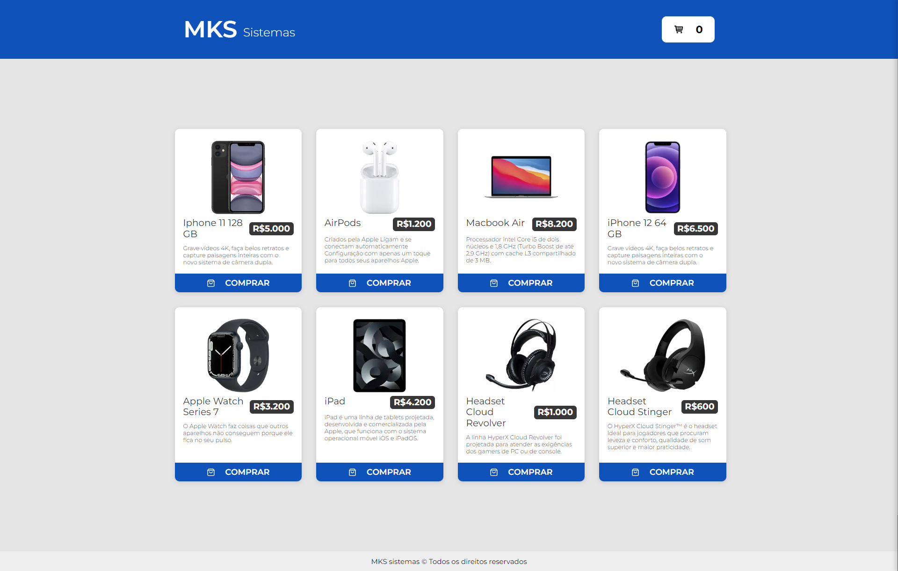
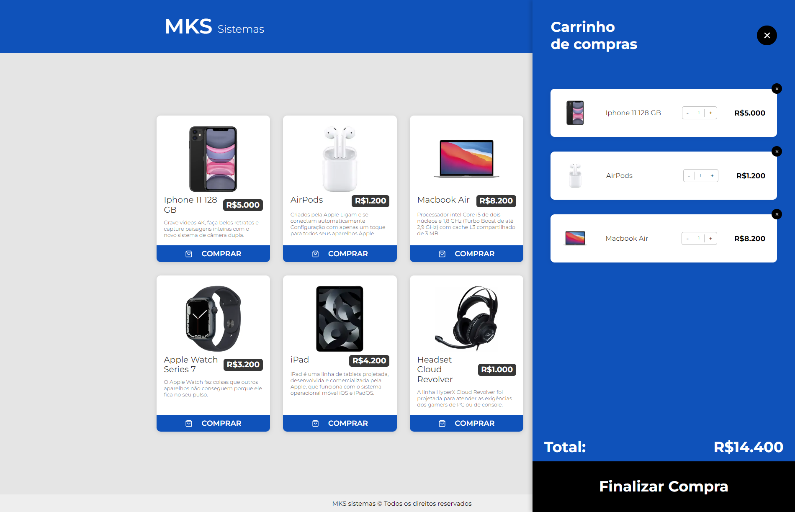

## Preview

<h1 align="center">
    
</h1>

## Carrinho

<h1 align="center">
    
</h1>

<br>

## ⚙️ Tecnologias

Este projeto foi desenvolvido utilizando:

- [NextJS](https://nextjs.org/)
- [Typescript](https://www.typescriptlang.org/)
- [Styled Components](https://styled-components.com/)
- [Redux toolkit](https://redux-toolkit.js.org/)

## 📌 Começando

Clone o projeto:

```bash
git clone https://github.com/gabrielcoutinh0/mks-challenge.git
cd mks-challenge
```

Instale as dependências :

```bash
npm install
npm run dev
```

## 🖼️ Layout

- [Figma](https://www.figma.com/file/Z4z8osDbK1ET7cjNzFRMrK/MKS-Front-end-challenge?node-id=0%3A1)
- [Challenge](https://github.com/MKS-desenvolvimento-de-sistemas/mks-frontend-challenge/blob/main/README.md)
